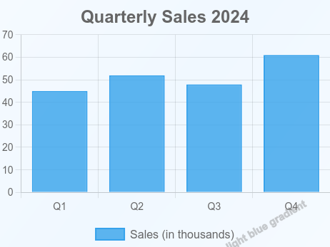
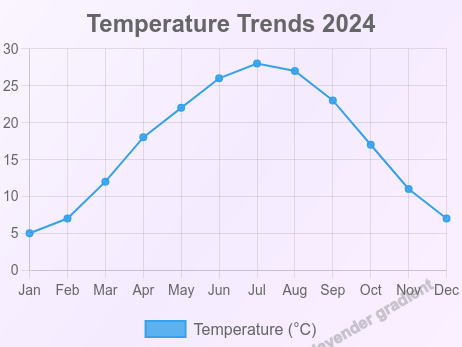
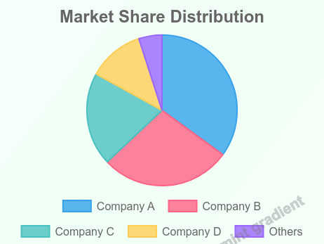
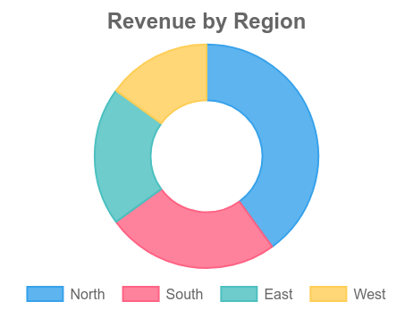
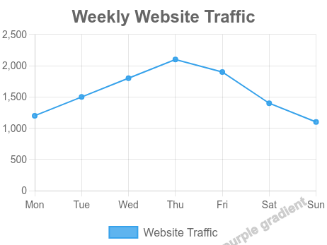

# Demo Images

This folder contains sample chart images generated by the MCP Chart Agent to demonstrate the various features and chart types supported by the system. These examples showcase the multi-agent architecture's ability to create professional data visualizations from natural language descriptions.

## Features Demonstrated

- **Multiple Chart Types**: Bar, line, pie, and doughnut charts
- **Background Generation**: AI-powered background creation with gradients
- **Watermark Integration**: Automatic watermark generation from prompts
- **Natural Language Processing**: Charts generated from conversational prompts
- **Professional Styling**: Clean, publication-ready visualizations

## Sample Charts

| | | |
|---|---|---|
| <br/>**Bar Chart**<br/>Quarterly Sales 2024 | <br/>**Line Chart**<br/>Temperature Trends 2024 | <br/>**Pie Chart**<br/>Market Share Distribution |
| <br/>**Bar Chart with Background**<br/>Product Sales (Blue Gradient) | <br/>**Doughnut Chart**<br/>Revenue by Region | <br/>**Line Chart with Background**<br/>Website Traffic (Purple Gradient) |

## Chart Details

### 1. Bar Chart - Quarterly Sales
- **Type**: Bar Chart
- **Data**: Q1-Q4 sales figures (45K, 52K, 48K, 61K)
- **Features**: Standard bar visualization with legend
- **Use Case**: Comparing discrete categories over time periods

### 2. Line Chart - Temperature Trends
- **Type**: Line Chart
- **Data**: Monthly temperature readings (°C) for 12 months
- **Features**: Time series visualization with smooth line
- **Use Case**: Tracking trends and patterns over time

### 3. Pie Chart - Market Share
- **Type**: Pie Chart
- **Data**: Market share percentages (Company A: 35%, B: 28%, C: 20%, D: 12%, Others: 5%)
- **Features**: Proportional representation with color coding
- **Use Case**: Showing composition and relative proportions

### 4. Bar Chart with Background
- **Type**: Bar Chart
- **Data**: Product sales units (120, 95, 150, 110, 135)
- **Features**: Blue gradient background + watermark
- **Use Case**: Enhanced visual appeal with custom backgrounds

### 5. Doughnut Chart - Revenue
- **Type**: Doughnut Chart
- **Data**: Revenue by region (North: 40%, South: 25%, East: 20%, West: 15%)
- **Features**: Doughnut variant with center space
- **Use Case**: Similar to pie charts with modern aesthetic

### 6. Line Chart with Background
- **Type**: Line Chart
- **Data**: Weekly website traffic (Mon-Sun: 1200-2100 visitors)
- **Features**: Purple gradient background + watermark
- **Use Case**: Trend visualization with enhanced styling

## Regenerating Images

To regenerate these demo images, run:

```bash
npm run generate-demo
```

This will create/update all 6 sample images in this directory using predefined data and configurations.

## Technical Specifications

- **Format**: PNG
- **Dimensions**: 462×347 pixels (optimized for web)
- **Background**: White default, gradient options available
- **Watermarks**: Semi-transparent, rotated text (when enabled)
- **Colors**: Chart.js default color palette with transparency
- **Rendering**: Server-side using @napi-rs/canvas and Chart.js

## Usage in Documentation

These images are used in:
- Main README.md preview
- Documentation examples
- GitHub repository previews
- Project presentations and demos
- Feature showcase materials

## How These Were Generated

All charts were generated using the MCP Chart Agent's multi-agent system:

1. **Chart Agent**: Processes natural language and generates chart specifications
2. **Background Agent**: Creates visual backgrounds using AI descriptions
3. **Watermark Agent**: Adds watermarks using background descriptions

The system uses Ollama (phi3:mini model) for natural language understanding and Chart.js for rendering.
